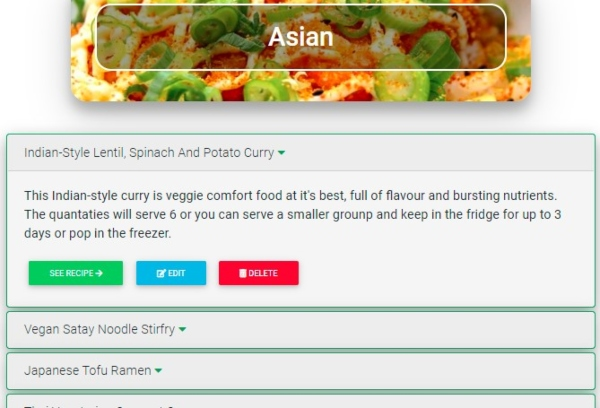
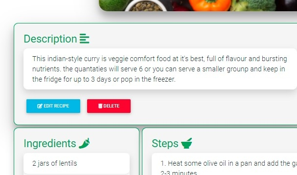

<h1 align="center"><strong>Vegtabible App</strong></h1>

[View live project here](https://vegtabible-app.herokuapp.com/index)

**The recipe bible for vegetarians and "part-time" veggies.**

Vegtabible is a digital cookbook app which allows users to upload and share recipes with the Vegtabible community and search all the recipes that have been uploaded by other users. 

The website is aimed at vegetarians but more particularly at the growing number of “part-time” vegetarians – people who are making an effort to eat vegetarian meals a couple of times per week be it for environmental and/or health reasons, or maybe simply just because they like to. 

The problem for many “part-time” veggies is that they’re repertoire of tasty veggie meals is generally quite limited, in comparison to full-time vegetarians. Vegtabible, therefore, is a platform that allows them to discover new vegetarian meals, as well as upload and share their own discoveries with the community. 

From handwritten notes, printed-out sheets and cookbooks, to recipes bookmarked on our web browsers, screenshots on our phones, or Whatsapp messages, one major issue many homecooks have is that their recipes are saved and scattered all over the place. It can be hard find, let alone remember them all. Vegtabible allows users to store all of their favorite veggie recipes in one place, while also discovering new ones. 

<h2 align="center"></h2>

### **Features**:

- **Search recipes by category:** users can search recipes by categories. Vegtabible has 6 categories: Asian, American, Mediterranean, Sides, Salads and Other.
- **Search recipes by keyword / title:** users can also use the search function to search recipes using title, keywords or ingredients. 
- **Create recipe page:** users can add recipes using a simple form which, when submitted, is added to the chosen category section and is rendered as a recipe.html page
- **Edit recipes:** users can edit and update recipes using a simple form. 
- **Delete recipes:** users can also delete recipes when necessary, perhaps in the event that a meat-based recipe is accidentally added which is not suitable. 

## **UX**

---

### <u>**User Stories**</u>

- ####  Visitor Goals

  - a) As a First Time Visitor, I want to easily understand the main purpose of the website and quickly understand its structure.

  - b) As a First Time Visitor or Returning Visitor, I want to search recipes available on the Vegtabible website.

  - c) As a First Time or Returning Visitor, I want to create and add a recipe to the Vegtabible website.

  - d) As a Returning Visitor, I want to find a particular recipe I had added or seen on a previous visit.

  - e) As a Returning Visitor, I want to edit/update a recipe.

  - f) As a Returning Visitor, I want to delete a recipe.

  - g) As a First Time or Returning Visitor, I want to get in contact with Vegtabible to report an issue, submit a query, or gain more information. 

### <u>**Design**</u>

- #### Colors

    - A deep green color is the main color used which is in line with the tone of the website, as green is a color generally associated with vegetables. Category cards, recipe panels and forms are colored with a light-grey so that they stand out from the general white background of the body.

    - Orange is used for the search button on the homepage and also for user alert messages. 

    - Red, greens and blues have been used for buttons throughout the page.

    - Overall, the website has a vibrant color scheme which is reflective of the rich and varied colors of food ingredients.

    

- #### Fonts

    - "Hammersmith One" has been chosen for the Navbar brand logo (with sans seriff as back-up). "Roboto" has been employed everywhere else on the site, for headings and main text (with sans seriff as back-up).

- #### Imagery

    - Striking, colorful images of dishes and food ingredients have been used throughout.
    - On the homepage, the heading background image of tomatoes contains deep red colors that work well the rest of the colors on the page. 
    - In the category cards section of the homepage, an image of a particular dish has been chosen that reflects each category, giving users an immediate visual clue as to the content of each category. 
    - The title of each page contains a different colorful background image of popular ingredients. 

- #### Icons

    - Visual icons have been used throughout the site to improve user experience, create a more aesthetically pleasing look, and provide immediate visual clues to readers regarding certain sections, buttons and navlinks.

## **TECHNOLOGIES USED**
-----
### <strong>Languages Used</strong>

-   [HTML5](https://en.wikipedia.org/wiki/HTML5)
-   [CSS3](https://en.wikipedia.org/wiki/Cascading_Style_Sheets)
-   [Javascript](https://en.wikipedia.org/wiki/JavaScript)
-   [Python](https://en.wikipedia.org/wiki/Python)

### <strong>Frameworks, Libraries & Programs Used</strong>

- [Material Design for Bootstrap 4:](https://mdbootstrap.com/docs/b4/jquery/)
    -   Material Design for Bootstrap 4 was used to assist with the responsiveness, positioning and styling of elements of the website. 
- [Google Fonts:](https://fonts.google.com/)
    - Google fonts was used to import the 'Hammersmith" font used for the Navbar brand logo.
- [Font Awesome:](https://fontawesome.com/)
    - Font Awesome was used to add icons for aesthetic, UX and functional purposes. 
- [jQuery:](https://jquery.com/)
    - jQuery is used for the navbar toggler function, and for user interactivity (e.g. to dynamically show, hide, add and delete elements acorss the website).
- [Flask:](https://jquery.com/)
    - Flask and the Jinja templating language is used to develop the web-based appplication using python.
- [Gitpod](https://github.com/) 
    - Gitpod is used as the IDE to develop the project.
- [Git](https://git-scm.com/)
    - Git is used for version control by utilizing the Gitpod terminal to commit to Git and Push to GitHub.
- [GitHub:](https://github.com/)
    - GitHub is used to store the projects code after being pushed from Git.
- [Heroku:](https://www.heroku.com/)
    - Heroku is used to deploy the project to the web and is linked to the GitHub repo (see more in Deployment section)
- [MongoDB:](https://www.mongodb.com/)
    - MongoDB is used to design and create a database, where all recipe data is stored at the backend.
- [Balsamiq:](https://balsamiq.com/)
    - Balsamiq was used to create the wireframes during the design process.

## **TESTING**
---

- The website was tested on Google Chrome, Microsoft Edge, Firefox and Safari browsers.
- The website was viewed on a variety of devices such as Desktop, Laptop, Tablet, iPhone 6s, iPhone SE, Huawei Y6, Huawei P9 and Samsung Phones.
- A large amount of testing was done to ensure that all pages were linking correctly, and buttons and forms sections were working as intended (more details below).
- Friends and family members were asked to review the site and documentation to point out any bugs and/or user experience issues.

### <u>**User Stories Testing**</u>

####  **<em>a) As a First Time Visitor, I want to easily understand the main purpose of the website and quickly understand its structure.</em>**

- **i)** Upon landing on the site for the first time, the Homepage content and structure makes the website's purpose and function immediately clear to the visitor.

- **ii)** Visitors will be first drawn to "The Digital Vegetarian Cookbook" heading, which makes the websites purpose immediatly clear.

- **iii)** Below the heading, the 'Add' and 'Search' call-to-action buttons makes the website's main functions immediately clear to the visitor.

- **iv)** Below the 'Add' and 'Search' buttons, the recipe category cards give the visitor more specific information on the contents of the website and how that content is structured. 

- **v)** The Navigation bar also gives the user an overview of the website's simple and clean structure, as well as its main functions, all of which can be easily accessed from the navigation bar at any point on the website. Clicking on the Vegtabible logo will bring users back to the Homepage from any point in the website. 

####  **<em>b) As a First Time Visitor or Returning Visitor, I want to search recipes available on the website.</em>**

- **i)** Visitors can search recipes in two ways: searching by category or using the search bar function.

- **ii)** Searching by category: The categories are easily found on the Homepage, and can also be reached at any point in the website by clicking on the dropdown menu in the navigation bar. 

      

- **iii)** When a user clicks on a category, they will be immediately directed to the Category landing page, where they will find an easily readable list of all the recipes available under that category.

    

- **iv)** Searchbar: Users can access the searchbar function from the Homepage by clicking the search button, or at any point in the website by clicking on the search icon in the navigation bar. 

     

- **v)** Clicking on the 'Search' button or the 'Navbar Search' icon will direct users to the Search page. Here they can search recipes by introducing keywords. Retrieved recipes relevant to the keyword are displayed in an easily readible list, whose structure is identical to the category landing page list. In the screenshot example below, the user has typed "burger" into the search input field and then pressed the search button.

    

- **vi)** When a user clicks on a recipe from the list on the Search page or Category landing page, it reveals the recipe's "description" section, which includes the 'See Recipe' button. Clicking the 'See Recipe' button will bring them directly to the Recipe page, which is broken into four sections: Description, Info, Ingredient, Steps. 

      

####  **<em>c) As a First Time or Returning Visitor, I want to create and add a recipe to the Vegtabible website</em>**

- **i)** Visitors can reach the 'Add Recipe' page in two ways: clicking on the 'Add' button on the homepage, or clicking the Add (+) icon on the navigation bar at any point in the website.
   
     

- **ii)** Clicking on the 'Add' button or the navbar Add (+) icon will direct users to the 'Add Recipe' page, which includes a simple form to fill out. On submit the recipe will be added to website. (This will be covered in more detail in the Functionality Testing section) 

    

####  **<em>d) As a Returning Visitor, I want to find a particular recipe I had added or seen on a previous visit</em>**

- **i)** To find a particular recipe, users can use the searchbar function outlined above in section C (iv-v). They can then locate the recipe by typing the keyword or title in the search input.

####  **<em>e) As a Returning Visitor, I want to edit/update a recipe.</em>**

- **i)** Users can first locate the recipe by following the steps outlined in section C (search by category / using searchbar) 
- **ii)** Users can click on the recipe from the list on the Search page or Category landing page, this will open the "description" section, where the 'Edit Recipe' button is clearly visible.

     

- **iii)** Alternatively, users can find the 'Edit Recipe' button on the "description" section of the Recipe page.

    

- **iv)** Clicking on the 'Edit Recipe' button will direct the user to the 'Edit Recipe' page, which contains a simple form that already includes all of the recipe details. Here they can change/update/add/delete any of those details. They can then hit sumbit to confirm the changes to the recipe. (This will be covered in more detail in the Functionality Testing section)

    

    

####  **<em>f) As a Returning Visitor, I want to delete a recipe. </em>**

- **i)** Users can first locate the recipe by following the steps outlined in section C (search by category / using searchbar) 
- **ii)** Users can click on the recipe from the list on the Search page or Category landing page, this will open the "description" section, where the 'Delete Recipe' button is clearly visible.

     
        
- **iii)** Alternatively, users can find the 'Delete Recipe' button on the "description" section of the Recipe page.

    

- **iv)** Clicking on the 'Delete Recipe' button will prompt the user to confirm or cancel (Yes/No) the recipe deletion. Clicking confirm (Yes) will permanently delete the recipe from the database.

    

### <u>**Functionality Testing**</u>

*The following (all) functionality and interactive features of the entire website were checked to ensure they are working correctly:*

### ***1. Navigation:***

- The Vegtabible logo: When clicked, it returns users to the homepage
- Add recipe link: Changes color when hovered over. When clicked, it directs users to the Add Recipe page
- Search recipe link: Changes color when hovered over. When clicked, it directs users to the Search Recipe page
- Categories Popup Menu: Changes color when hovered over. When clicked, it opens the popop menu showing the six category links.
- Category links: Each category link directs the user to the correct chosen category page. 
- 'Hamburger' toggle button: For smaller screens, the hamburger toggle button appears and, when clicked, shows/hides navbar links.

### ***2. Home Page:***

**Buttons**

- 'Add Recipe' button: Box shadow darkens when hovered over. When clicked, it directs users to the Add Recipe page
- 'Search Button' button: Box shadow darkens when hovered over. When clicked, it directs users to the Search page

**Category Cards**

- Asian Card: Box shadow darkens when hovered over. When clicked, it directs users to the Asian Category landing page
- American Card: Box shadow darkens when hovered over. When clicked, it directs users to the American Category landing page
- Mediterranean Card: Box shadow darkens when hovered over. When clicked, it directs users to the Mediterranean Category landing page
- Salads: Box shadow darkens when hovered over. When clicked, it directs users to the Salads Category landing page
- Sides: Box shadow darkens when hovered over. When clicked, it directs users to the Sides Category landing page
- Other: Box shadow darkens when hovered over. When clicked, it directs users to the Other Category landing page

### ***3. Category Landing Page:***

- When user clicks on a category (from the Homepage or from the Navbar popup menu), they are taken to the category.html page which is populated with information from the database on the chosen category: Title and background image is generated; list of recipes under the chosen category are generated from the database. (Two examples are shown below):

     

- When a recipe panel from the list is hovered over, background turns orange. When clicked, it opens the "description" section. When clicked again, this section is closed. 

    

- 'See Recipe' button: Box shadown darkens when hovered over. When clicked, it directs users to the Recipe page for the chosen recipe. 

- 'Edit Recipe' button: Box shadown darkens when hovered over. When clicked, it directs users to the Edit Recipe page. 

- 'Delete Recipe' button:

    - Box shadown darkens when hovered over. When clicked, it reveals the confirm delete section. 

         

    - Clicking the 'No' button once again hides the "confirm delete" section, to indicate the deleting action has been cancelled

        
    
    - Clicking 'Yes': redirects users to the hompepage and shows a flash message to confirm the recipe has been deleted; Recipe is deleted from database and no longer appears on the website. 

        

### ***4. Recipe Page:***

-   When a user clicks on the 'See Recipe' button (either from the list on the Category landing page or a generated list on the Search page), they are taken to the category.html page which is populated with information from the database on the chosen recipe. This information is broken into the four sections: Description, Info, Ingredients, Steps:

    

- 'Edit Recipe' button: Box shadown darkens when hovered over. When clicked, it directs users to the Edit Recipe page. 

- 'Delete Recipe' button: Box shadown darkens when hovered over. When clicked, it directs users to the Edit Recipe page.

    - Box shadown darkens when hovered over. When clicked, it reveals the confirm delete section. 

         

    - Clicking the 'No' button once again hides the "confirm delete" section, to indicate the deleting action has been cancelled

        
    
    - Clicking 'Yes': redirects users to the hompepage and shows a flash message to confirm the recipe has been deleted; Recipe is deleted from database and no longer appears on the website. 

        