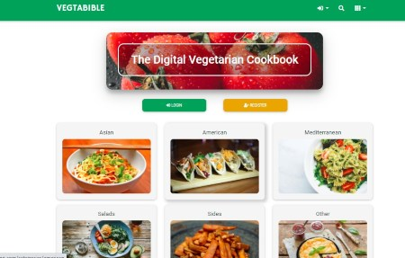
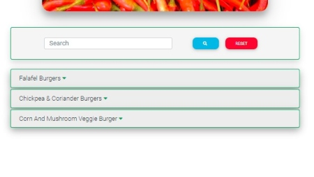

<h1 align="center"><strong>Vegtabible App</strong></h1>

[View live project here](https://vegtabible-app.herokuapp.com/index)

**The recipe bible for vegetarians and "part-time" veggies.**

Vegtabible is a digital cookbook app which allows users to upload and share recipes with the Vegtabible community and search all the recipes that have been uploaded by other users. 

The website is aimed at vegetarians but more particularly at the growing number of “part-time” vegetarians – people who are making an effort to eat vegetarian meals a couple of times per week be it for environmental and/or health reasons, or maybe simply just because they like to. 

The problem for many “part-time” veggies is that they’re repertoire of tasty veggie meals is generally quite limited, in comparison to full-time vegetarians. Vegtabible, therefore, is a platform that allows them to discover new vegetarian meals, as well as upload and share their own discoveries with the community. 

From handwritten notes, printed-out sheets and cookbooks, to recipes bookmarked on our web browsers, screenshots on our phones, or Whatsapp messages, one major issue many homecooks have is that their recipes are saved and scattered all over the place. It can be hard find, let alone remember them all. Vegtabible allows users to store all of their favorite veggie recipes in one place, while also discovering new ones. 

<h2 align="center"></h2>

### **Features**:

- **Search recipes by category:** users can search recipes by categories. Vegtabible has 6 categories: Asian, American, Mediterranean, Sides, Salads and Other.
- **Search recipes by keyword / title:** users can also use the search function to search recipes using title, keywords or ingredients. 
- **Create recipe page:** users can add recipes using a simple form which, when submitted, is added to the chosen category section and is rendered as a recipe.html page
- **Edit recipes:** users can edit and update recipes using a simple form. 
- **Delete recipes:** users can also delete recipes when necessary, perhaps in the event that a meat-based recipe is accidentally added which is not suitable. 

## **UX**

---

### <u>**User Stories**</u>

- ####  Visitor Goals

  - a) As a First Time Visitor, I want to easily understand the main purpose of the website and quickly understand its structure.

  - b) As a First Time Visitor or Returning Visitor, I want to search recipes available on the Vegtabible website.

  - c) As a First Time Visitor, I want to register as a user to gain access to website's full functionality.

  - d) As a Returning Registered Visitor, I want to login to the Vegtabible website to gain access to website's full functionality.

  - e) As a Registered User, I want to create and add a recipe to the Vegtabible website.

  - f) As a Returning Registered User, I want to see/access all of the recipes I have added to the Vegtabible website.

  - g) As a Returning Registered User, I want to edit/update a recipe.

  - h) As a Returning Registered User, I want to delete a recipe.

  - i) As a First Time or Returning Visitor, I want to get in contact with Vegtabible to report an issue, submit a query, or gain more information. 

### <u>**Design**</u>

- #### Colors

    - A deep green color is the main color used which is in line with the tone of the website, as green is a color generally associated with vegetables. Category cards, recipe panels and forms are colored with a light-grey so that they stand out from the general white background of the body.

    - Orange is used for the search button on the homepage and also for user alert messages. 

    - Red, greens and blues have been used for buttons throughout the page.

    - Overall, the website has a vibrant color scheme which is reflective of the rich and varied colors of food ingredients.

    

- #### Fonts

    - "Hammersmith One" has been chosen for the Navbar brand logo (with sans seriff as back-up). "Roboto" has been employed everywhere else on the site, for headings and main text (with sans seriff as back-up).

- #### Imagery

    - Striking, colorful images of dishes and food ingredients have been used throughout.
    - On the homepage, the heading background image of tomatoes contains deep red colors that work well the rest of the colors on the page. 
    - In the category cards section of the homepage, an image of a particular dish has been chosen that reflects each category, giving users an immediate visual clue as to the content of each category. 
    - The title of each page contains a different colorful background image of popular ingredients. 

- #### Icons

    - Visual icons have been used throughout the site to improve user experience, create a more aesthetically pleasing look, and provide immediate visual clues to readers regarding certain sections, buttons and navlinks.

## **TECHNOLOGIES USED**
-----
### <strong>Languages Used</strong>

-   [HTML5](https://en.wikipedia.org/wiki/HTML5)
-   [CSS3](https://en.wikipedia.org/wiki/Cascading_Style_Sheets)
-   [Javascript](https://en.wikipedia.org/wiki/JavaScript)
-   [Python](https://en.wikipedia.org/wiki/Python)

### <strong>Frameworks, Libraries & Programs Used</strong>

- [Material Design for Bootstrap 4:](https://mdbootstrap.com/docs/b4/jquery/)
    -   Material Design for Bootstrap 4 was used to assist with the responsiveness, positioning and styling of elements of the website. 
- [Google Fonts:](https://fonts.google.com/)
    - Google fonts was used to import the 'Hammersmith" font used for the Navbar brand logo.
- [Font Awesome:](https://fontawesome.com/)
    - Font Awesome was used to add icons for aesthetic, UX and functional purposes. 
- [jQuery:](https://jquery.com/)
    - jQuery is used for the navbar toggler function, and for user interactivity (e.g. to dynamically show, hide, add and delete elements acorss the website).
- [Flask:](https://jquery.com/)
    - Flask and the Jinja templating language is used to develop the web-based appplication using python.
- [Gitpod](https://github.com/) 
    - Gitpod is used as the IDE to develop the project.
- [Git](https://git-scm.com/)
    - Git is used for version control by utilizing the Gitpod terminal to commit to Git and Push to GitHub.
- [GitHub:](https://github.com/)
    - GitHub is used to store the projects code after being pushed from Git.
- [Heroku:](https://www.heroku.com/)
    - Heroku is used to deploy the project to the web and is linked to the GitHub repo (see more in Deployment section)
- [MongoDB:](https://www.mongodb.com/)
    - MongoDB is used to design and create a database, where all recipe data is stored at the backend.
- [Balsamiq:](https://balsamiq.com/)
    - Balsamiq was used to create the wireframes during the design process.

## **TESTING**
---

- The website was tested on Google Chrome, Microsoft Edge, Firefox and Safari browsers.
- The website was viewed on a variety of devices such as Desktop, Laptop, Tablet, iPhone 6s, iPhone SE, Huawei Y6, Huawei P9 and Samsung Phones.
- A large amount of testing was done to ensure that all pages were linking correctly, and buttons and forms sections were working as intended (more details below).
- Friends, family members and fellow Code Institute students were asked to review the site and documentation to point out any bugs and/or user experience issues.

### <u>**User Stories Testing**</u>

####  **<em>a) As a First Time Visitor, I want to easily understand the main purpose of the website and quickly understand its structure.</em>**

- **i)** Upon landing on the site for the first time, the Homepage content and structure makes the website's purpose and function immediately clear to the visitor.

- **ii)** Visitors will be first drawn to "The Digital Vegetarian Cookbook" heading, which makes the website's purpose immediately clear.

- **iii)** Below the heading, the 'Log In' and 'Register' call-to-action buttons prompt visitors to take action in order to gain access to the website's full functionality.

- **iv)** Below the 'Log In' and 'Register' buttons, the recipe category cards give the visitor more specific information on the contents of the website and how that content is structured. 

     

- **v)** Once the user has registered (as outlined in section C below), the 'Add' and 'Search' buttons appear below the Homepage heading, while the 'Add' and 'User Profile' sections are added to the navigation bar, which gives them a full overview of the website's structure. 

- **vi)** The navigation bar gives the user an overview of the website's simple and clean structure, as well as its main functions, all of which can be easily accessed from the navigation bar at any point on the website. Clicking on the 'Vegtabible' logo will bring users back to the Homepage from any point in the website. 

####  **<em>b) As a First Time Visitor or Returning Visitor, I want to search recipes available on the website.</em>**

- **i)** Visitors, both regisetered and unregistered, can search recipes in two ways: searching by category or using the searchbar function.

- **ii)** Searching by category: The categories are easily found on the Homepage, and can also be reached at any point in the website by clicking on the dropdown menu in the navigation bar. 

      

- **iii)** When a user clicks on a category, they will be directed to the Category landing page, where they will find an easily readable list of all the recipes available under that category.

    

- **iv)** Searchbar: Users can access the searchbar function at any point in the website by clicking on the 'Search' link in the navigation bar. Once registered or logged in, they can also access the searchbar function by clicking on the 'Search' button on the Homepage.

      

- **v)** Clicking on the 'Search' button or the 'Search' navbar link will direct users to the Search page. Here they can search recipes by inputting keywords. Retrieved recipes relevant to the keyword are displayed in an easily readible list, whose structure is identical to the category landing page list. In the screenshot example below, the user has typed "burger" into the search input field and then pressed the 'Search' button.

    

- **vi)** When a user clicks on a recipe from the list on the Search page or Category landing page, it reveals the recipe's "description" section, which includes the 'See Recipe' button (the 'Edit' and 'Delete' buttons only appear for those recipes that have been added by the logged in user, see more in sections G and H below). Clicking the 'See Recipe' button will bring them directly to the Recipe page, which is broken into four sections: Description, Info, Ingredient, Steps. 

     

####  **<em>c) As a First Time Visitor, I want to register as a user to gain access to the website's full functionality.</em>** 

<em> Unregistered users can only search recipes. In order to upload, save, edit and delete recipes. Visitors must register by filling out a simple form.</em>

- **i)** Upon landing on the Homepage, a 'Register' call-to-action button is clearly visible in a prominent position on the page.

- **ii)** Should visitors choose to browse recipes before registering, they can also reach the Register page from the navbar link at any point on the website.

- **iii)** Clicking on the 'Register' call-to-action button or on the 'Register' navbar link will direct users to the Register page.

- **iv)** Users are requested to input some basic information (username, first name and lastname) and choose a password. They will require the username and password to log in once registered. Users are prompted to choose a minimum of 5 characters for their username and password. If they try to submit a username and/or password of less than 5 characters, they will not be allowed to proceed with registration and will be prompted to address the error. If they leave any field empty, they will also unable to proceed with registration and will be prompted to fill out the relevant empty field.

- **v)** Once users have filled out the form correctly and clicked 'Register', they will be redirected to the Homepage and a flash message informs them that the registration has been successful. From this point they will be able to access the 'Add Recipe' function and access the 'User Profile' section of the navbar.

- **vi)** If the user chooses a username that already exists for another registered user, they will be unable to proceed with the registration. A flash message will inform them that the "Username already exists", prompting them to choose another username.

- **vii)** If the user has already registered and has landed on the Register page (perhaps by mistake), they are prompted with a message that will redirect them to the Log In page.

####  **<em>d) As a Returning Registered Visitor, I want to log in to the Vegtabible website to gain access to the website's full functionality.</em>**

- **i)** Upon landing on the homepage, a 'Log In' call-to-action button is clearly visible in a prominent position on the page.

- **ii)** Should visitors choose to browse recipes before logging in, they can also reach the Log In page from the navbar link at any point on the website.

- **iii)** Clicking on the 'Log In' call-to-action button or on the 'Log In' navbar link will direct users to the Log In page.

- **iv)** Users are requested to input their username and password (as chosen during the registration process outlined above). 

- **v)** Once they input the correct username and password, they will be redirected to the Homepage and flash message informs them that they have logged in successfully.

- **vi)** If the user inputs an incorrect username and/or password, they will be unable to proceed with loggin in. A flash message will inform them that they have inputted an "Incorrect Username and/or Password", prompting them to resubmit their credentials again.

- **vii)** If the user has landed on the Log In page but has not yet registered, they are prompted with a message that will redirect them to the Register page.

####  **<em>e) As a Registered User, I want to create and add a recipe to the Vegtabible website</em>**

- **i)** Once registered and logged in, users can reach the 'Add Recipe' page in two ways: clicking on the 'Add' button on the Homepage, or clicking the 'Add' link (represented by a 'plus-sign' icon) on the navigation bar at any point in the website.
   
     

- **ii)** Clicking on the 'Add' button or the 'Add' navbar link will direct users to the Add Recipe page, which contains a simple form to fill out. On submit the recipe will be added to website and a flash message will inform the user that the recipe has been added successfully. (The Add Recipe function will be covered in more detail in the Functionality Testing section below) 

     

####  **<em>f) As a Returning Registered User, I want to see/access all of the recipes I have added to the Vegtabible website.</em>**

- **i)** Once registered and logged in, users can go to the My Recipes page to see a list of all of the recipes they have added to the website.

- **ii)** Users can easily access the My Recipes page by clicking on the 'Profile' link in the navbar.

- **iii)** Clicking on the 'My Recipes' link will bring them to their My Recipes page. This contains a list of all the recipes they added to the website.

- **iv)** From here they can view, edit or delete any of the recipes they have added to the website.

####  **<em>g) As a Returning Registered Visitor, I want to edit/update a recipe.</em>**

<em> Users can only edit recipes that they themselves have added. They will not have access to the edit function for recipes added by other users.</em>

- **i)** Users can see all of their recipes by going to their My Recipes page. Clicking on a recipe in the list will open the "description" section, which contains the 'Edit Recipe' button. The 'Edit Recipe' button also appears on the Recipe page for any recipes added by the user.

- **ii)** Clicking on the 'Edit Recipe' button will direct the user to the Edit Recipe page, which contains a simple form that already includes all of the recipe details. Here they can change/update/add/delete any of those details. Once they submit, a flash message will appear to inform that the changes have been saved correctly (The Edit Recipe function will be covered in more detail in the Functionality Testing section below)

    

    

<em> Aside from the My Recipes page, users can access the 'Edit Recipe' button from the Search, Category Landing or Recipe page. However the button will only appear for recipes added by the logged in user to ensure that they can only edit their own recipes and not those added by other users.</em>

####  **<em>h) As a Returning Registered Visitor, I want to delete a recipe. </em>**

<em> Users can only delete recipes that they themselves have added. They will not have access to the delete function for recipes added by other users.</em>

- **i)** Users can see all of their recipes by going to their My Recipes page. Clicking on a recipe in the list will open the "description" section, which contains the 'Delete Recipe' button. The 'Delete Recipe' button also appears on the Recipe page for any recipes added by the user.
- **ii)** Users can click on the recipe from the list on the Search page or Category landing page, this will open the "description" section, where the 'Delete Recipe' button is clearly visible.
- **iii)** Clicking on the 'Delete Recipe' button will prompt the user to confirm or cancel (Yes/No) the recipe deletion. Clicking confirm (Yes) will permanently delete the recipe from the database.

    

<em> Aside from the My Recipes page, users can access the 'Edit Recipe' button from the Search, Category Landing or Recipe page. However the button will only appear for recipes added by the logged in user to ensure that they can only edit their own recipes and not those added by other users.</em>

####  **<em>i) As a First Time or Returning Visitor, I want to get in contact with Vegtabible to report an issue, submit a query, or gain more information. </em>**

- **i)** Registered and non-registered users can access the contact page by clicking on the 'Message' icon on the navbar.
- **ii)** Clicking the 'Message' Icon directs them to the contact page, where they can find the email address to get in touch.
- **iii)** Clicking on the email address will automatically open a blank email on the users email app with the Vegtabible address already filled 

### <u>**Functionality Testing**</u>

*The following (all) functionality and interactive features of the entire website were checked to ensure they are working correctly:*

### ***1. Navigation:***

- The Vegtabible logo: When clicked, it returns users to the homepage
- Add recipe link: Changes color when hovered over. When clicked, it directs users to the Add Recipe page
- Search recipe link: Changes color when hovered over. When clicked, it directs users to the Search Recipe page
- Categories Popup Menu: Changes color when hovered over. When clicked, it opens the popop menu showing the six category links.
- Category links: Each category link directs the user to the correct chosen category page. 
- 'Hamburger' toggle button: For smaller screens, the hamburger toggle button appears and, when clicked, shows/hides navbar links.

### ***2. Home Page:***

**Buttons**

- 'Add Recipe' button: Box shadow darkens when hovered over. When clicked, it directs users to the Add Recipe page
- 'Search Button' button: Box shadow darkens when hovered over. When clicked, it directs users to the Search page

**Category Cards**

- Asian Card: Box shadow darkens when hovered over. When clicked, it directs users to the Asian Category landing page
- American Card: Box shadow darkens when hovered over. When clicked, it directs users to the American Category landing page
- Mediterranean Card: Box shadow darkens when hovered over. When clicked, it directs users to the Mediterranean Category landing page
- Salads: Box shadow darkens when hovered over. When clicked, it directs users to the Salads Category landing page
- Sides: Box shadow darkens when hovered over. When clicked, it directs users to the Sides Category landing page
- Other: Box shadow darkens when hovered over. When clicked, it directs users to the Other Category landing page

### ***3. Category Landing Page:***

- When user clicks on a category (from the Homepage or from the Navbar popup menu), they are taken to the category.html page which is populated with information from the database on the chosen category: Title and background image is generated; list of recipes under the chosen category are generated from the database. (Two examples are shown below):

     

- When a recipe panel from the list is hovered over, background turns orange. When clicked, it opens the "description" section. When clicked again, this section is closed. 

    

- 'See Recipe' button: Box shadown darkens when hovered over. When clicked, it directs users to the Recipe page for the chosen recipe. 

- 'Edit Recipe' button: Box shadown darkens when hovered over. When clicked, it directs users to the Edit Recipe page. 

- 'Delete Recipe' button:

    - Box shadown darkens when hovered over. When clicked, it reveals the confirm delete section. 

         

    - Clicking the 'No' button once again hides the "confirm delete" section, to indicate the deleting action has been cancelled

        
    
    - Clicking 'Yes': redirects users to the hompepage and shows a flash message to confirm the recipe has been deleted; Recipe is deleted from database and no longer appears on the website. 

        

### ***4. Recipe Page:***

-   When a user clicks on the 'See Recipe' button (either from the list on the Category landing page or a generated list on the Search page), they are taken to the recipe.html page which is populated with information from the database on the chosen recipe. This information is broken into the four sections: Description, Info, Ingredients, Steps:

    

- 'Edit Recipe' button: Box shadown darkens when hovered over. When clicked, it directs users to the Edit Recipe page. 

- 'Delete Recipe' button: Box shadown darkens when hovered over. When clicked, it directs users to the Edit Recipe page.

    - Box shadown darkens when hovered over. When clicked, it reveals the confirm delete section. 

         

    - Clicking the 'No' button once again hides the "confirm delete" section, to indicate the deleting action has been cancelled

        
    
    - Clicking 'Yes': redirects users to the hompepage and shows a flash message to confirm the recipe has been deleted; Recipe is deleted from database and no longer appears on the website. 

        

### ***5. Add Recipe Page:***

-   When a user clicks on the 'Add Recipe' button on the homepage or add (+) icon in the navbar, they are taken to the add recipe page, which contains a form to fill out.

    

-  When a user clicks the 'Add Ingredient' button, an ingredient input is added to the form, allowing users to add as many ingredient inputs as desired. 

    

-  When a user clicks the 'Add Step' button, a step input is added to the form, allowing users to add as many step inputs as desired. 

    

- Clicking the 'Remove Ingredient' button will remove any unwanted extra inputs, if necessary (if user adds more than necessary by mistake). 

     

- Clicking the 'Remove Step' button will remove any unwanted extra steps, if necessary (if user adds more than necessary by mistake). 

     

- Upon clicking 'Add Recipe' once all required fields are filled, the user will be see a flash message telling them their recipe was successfully added. Their recipe is added to the Mongodb database.

      
    
    

- Adding recipe to mongodb will generate the recipe on the relevant category landing page. Clicking 'See Recipe' will generate the recipe.html populated with the recip information stored on mongodb.

     

### ***5. Edit Recipe Page:***

- Clicking on the 'Edit Recipe' button will direct the user to the 'Edit Recipe' page, which contains a simple form that is already populated with the chosen recipe details.

    

- When a user clicks the 'Add Ingredient' button, an ingredient input is added to the form, allowing users to add as many extra ingredient inputs as desired. 

    

-  When a user clicks the 'Add Step' button, a step input is added to the form, allowing users to add as many extra step inputs as desired. 

    

- Clicking the 'Remove Ingredient' button will remove any unwanted extra inputs, if necessary (if user adds more than necessary by mistake).

     

- Clicking the 'Remove Step' button will remove any unwanted extra steps, if necessary (if user adds more than necessary by mistake). 

     

- To update the recipe, users can make changes to any of the fields in the form. As an example in the screenshots (before and after) below: Servings have been changed from 4 to 6; cooking time from 25 to 30 minutes; no. of sweet potatoes from 2 to 3; and paprika has been added as another ingredient. 

      

- Upon clicking 'Update Recipe' once all desired changes are made, the user will be see a flash message telling them the recipe was successfully updated. The recipe is updated on the Mongodb database.

      

- The changes made to the updated recipe are also applied to the recipe page once the recipe has been updated on the mongodb database.

     

- Alternatively, upon clicking the 'Cancel Update' update, the user is redirected to the hompeage and no changes are made to the recipe. 
