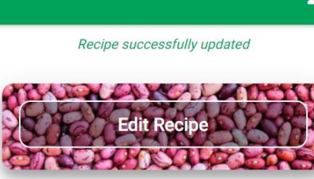
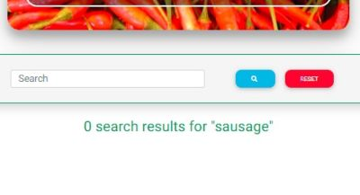
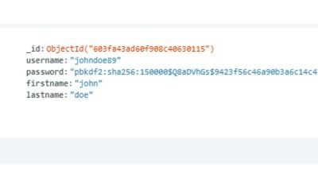
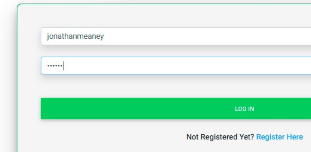

<h1 align="center"><strong>Vegtabible App</strong></h1>

[View live project here](https://vegtabible-app.herokuapp.com/index)

**The recipe bible for vegetarians and "part-time" veggies.**

Vegtabible is a digital cookbook app which allows users to upload and share recipes with the Vegtabible community and search all the recipes that have been uploaded by other users. 

The website is aimed at vegetarians but more particularly at the growing number of “part-time” vegetarians – people who are making an effort to eat vegetarian meals a couple of times per week be it for environmental and/or health reasons, or maybe simply just because they like to. 

The problem for many “part-time” veggies is that they’re repertoire of tasty veggie meals is generally quite limited, in comparison to full-time vegetarians. Vegtabible, therefore, is a platform that allows them to discover new vegetarian meals, as well as upload and share their own discoveries with the community. 

From handwritten notes, printed-out sheets and cookbooks, to recipes bookmarked on our web browsers, screenshots on our phones, or Whatsapp messages, one major issue many homecooks have is that their recipes are saved and scattered all over the place. It can be hard find, let alone remember them all. Vegtabible allows users to store all of their favorite veggie recipes in one place, while also discovering new ones. 

<h2 align="center"></h2>

### **Features**:

- **Search recipes by category:** users can search recipes by categories. Vegtabible has 6 categories: Asian, American, Mediterranean, Sides, Salads and Other.
- **Search recipes by keyword / title:** users can also use the search function to search recipes using title, keywords or ingredients. 
- **Create recipe page:** users can add recipes using a simple form which, when submitted, is added to the chosen category section and is rendered as a recipe.html page
- **Edit recipes:** users can edit and update recipes using a simple form. 
- **Delete recipes:** users can also delete recipes when necessary, perhaps in the event that a meat-based recipe is accidentally added which is not suitable. 

## **UX**

---

### <u>**User Stories**</u>

- ####  Visitor Goals

  - a) As a First Time Visitor, I want to easily understand the main purpose of the website and quickly understand its structure.

  - b) As a First Time Visitor or Returning Visitor, I want to search recipes available on the Vegtabible website.

  - c) As a First Time Visitor, I want to register as a user to gain access to website's full functionality.

  - d) As a Returning Registered Visitor, I want to login to the Vegtabible website to gain access to website's full functionality.

  - e) As a Registered User, I want to create and add a recipe to the Vegtabible website.

  - f) As a Returning Registered User, I want to see/access all of the recipes I have added to the Vegtabible website.

  - g) As a Returning Registered User, I want to edit/update a recipe.

  - h) As a Returning Registered User, I want to delete a recipe.

  - i) As a First Time or Returning Visitor, I want to get in contact with Vegtabible to report an issue, submit a query, or gain more information. 

### <u>**Design**</u>

- #### Colors

    - A deep green color is the main color used which is in line with the tone of the website, as green is a color generally associated with vegetables. Category cards, recipe panels and forms are colored with a light-grey so that they stand out from the general white background of the body.

    - Orange is used for the search button on the homepage and also for user alert messages. 

    - Red, greens and blues have been used for buttons throughout the page.

    - Overall, the website has a vibrant color scheme which is reflective of the rich and varied colors of food ingredients.

    

- #### Fonts

    - "Hammersmith One" has been chosen for the Navbar brand logo (with sans seriff as back-up). "Roboto" has been employed everywhere else on the site, for headings and main text (with sans seriff as back-up).

- #### Imagery

    - Striking, colorful images of dishes and food ingredients have been used throughout.
    - On the homepage, the heading background image of tomatoes contains deep red colors that work well the rest of the colors on the page. 
    - In the category cards section of the homepage, an image of a particular dish has been chosen that reflects each category, giving users an immediate visual clue as to the content of each category. 
    - The title of each page contains a different colorful background image of popular ingredients. 

- #### Icons

    - Visual icons have been used throughout the site to improve user experience, create a more aesthetically pleasing look, and provide immediate visual clues to readers regarding certain sections, buttons and navlinks.

## **TECHNOLOGIES USED**
-----
### <strong>Languages Used</strong>

-   [HTML5](https://en.wikipedia.org/wiki/HTML5)
-   [CSS3](https://en.wikipedia.org/wiki/Cascading_Style_Sheets)
-   [Javascript](https://en.wikipedia.org/wiki/JavaScript)
-   [Python](https://en.wikipedia.org/wiki/Python)

### <strong>Frameworks, Libraries & Programs Used</strong>

- [Material Design for Bootstrap 4:](https://mdbootstrap.com/docs/b4/jquery/)
    -   Material Design for Bootstrap 4 was used to assist with the responsiveness, positioning and styling of elements of the website. 
- [Google Fonts:](https://fonts.google.com/)
    - Google fonts was used to import the 'Hammersmith" font used for the Navbar brand logo.
- [Font Awesome:](https://fontawesome.com/)
    - Font Awesome was used to add icons for aesthetic, UX and functional purposes. 
- [jQuery:](https://jquery.com/)
    - jQuery is used for the navbar toggler function, and for user interactivity (e.g. to dynamically show, hide, add and delete elements acorss the website).
- [Flask:](https://jquery.com/)
    - Flask and the Jinja templating language is used to develop the web-based appplication using python.
- [Gitpod](https://github.com/) 
    - Gitpod is used as the IDE to develop the project.
- [Git](https://git-scm.com/)
    - Git is used for version control by utilizing the Gitpod terminal to commit to Git and Push to GitHub.
- [GitHub:](https://github.com/)
    - GitHub is used to store the projects code after being pushed from Git.
- [Heroku:](https://www.heroku.com/)
    - Heroku is used to deploy the project to the web and is linked to the GitHub repo (see more in Deployment section)
- [MongoDB:](https://www.mongodb.com/)
    - MongoDB is used to design and create a database, where all recipe data is stored at the backend.
- [Balsamiq:](https://balsamiq.com/)
    - Balsamiq was used to create the wireframes during the design process.

## **TESTING**
---

- The website was tested on Google Chrome, Microsoft Edge, Firefox and Safari browsers.
- The website was viewed on a variety of devices such as Desktop, Laptop, Tablet, iPhone 6s, iPhone SE, Huawei Y6, Huawei P9 and Samsung Phones. The website was found to be responsive across all of these devices. 
- A large amount of testing was done to ensure that all pages were linking correctly, and buttons and forms sections were working as intended (more details below).
- Friends, family members and fellow Code Institute students were asked to review the site and documentation to point out any bugs and/or user experience issues.

### <u>**User Stories Testing**</u>

####  **<em>a) As a First Time Visitor, I want to easily understand the main purpose of the website and quickly understand its structure.</em>**

- **i)** Upon landing on the site for the first time, the Homepage content and structure makes the website's purpose and function immediately clear to the visitor.

- **ii)** Visitors will be first drawn to "The Digital Vegetarian Cookbook" heading, which makes the website's purpose immediately clear.

- **iii)** Below the heading, the 'Log In' and 'Register' call-to-action buttons prompt visitors to take action in order to gain access to the website's full functionality.

- **iv)** Below the 'Log In' and 'Register' buttons, the recipe category cards give the visitor more specific information on the contents of the website and how that content is structured. 

     

- **v)** Once the user has registered (as outlined in section C below), the 'Add' and 'Search' buttons appear below the Homepage heading, while the 'Add' and 'User Profile' sections are added to the navigation bar, which gives them a full overview of the website's structure. 

- **vi)** The navigation bar gives the user an overview of the website's simple and clean structure, as well as its main functions, all of which can be easily accessed from the navigation bar at any point on the website. Clicking on the 'Vegtabible' logo will bring users back to the Homepage from any point in the website. 

    

####  **<em>b) As a First Time Visitor or Returning Visitor, I want to search recipes available on the website.</em>**

- **i)** Visitors, both regisetered and unregistered, can search recipes in two ways: searching by category or using the searchbar function.

- **ii)** Searching by category: The categories are easily found on the Homepage, and can also be reached at any point in the website by clicking on the dropdown menu in the navigation bar. 

      

- **iii)** When a user clicks on a category, they will be directed to the Category landing page, where they will find an easily readable list of all the recipes available under that category.

    

- **iv)** Searchbar: Users can access the searchbar function at any point in the website by clicking on the 'Search' link in the navigation bar. Once registered or logged in, they can also access the searchbar function by clicking on the 'Search' button on the Homepage.

      

- **v)** Clicking on the 'Search' button or the 'Search' navbar link will direct users to the Search page. Here they can search recipes by inputting keywords. Retrieved recipes relevant to the keyword are displayed in an easily readible list, whose structure is identical to the category landing page list. In the screenshot example below, the user has typed "burger" into the search input field and then pressed the 'Search' button.

    

- **vi)** When a user clicks on a recipe from the list on the Search page or Category landing page, it reveals the recipe's "description" section, which includes the 'See Recipe' button (the 'Edit' and 'Delete' buttons only appear for those recipes that have been added by the logged in user, see more in sections G and H below). Clicking the 'See Recipe' button will bring them directly to the Recipe page, which is broken into four sections: Description, Info, Ingredient, Steps. 

     

####  **<em>c) As a First Time Visitor, I want to register as a user to gain access to the website's full functionality.</em>** 

<em> Unregistered users can only search recipes. In order to upload, save, edit and delete recipes. Visitors must register by filling out a simple form.</em>

- **i)** Upon landing on the Homepage, a 'Register' call-to-action button is clearly visible in a prominent position on the page.

    

- **ii)** Should visitors choose to browse recipes before registering, they can also reach the Register page from the navbar link at any point on the website.

    

- **iii)** Clicking on the 'Register' call-to-action button or on the 'Register' navbar link will direct users to the Register page.

- **iv)** Users are requested to input some basic information (username, first name and lastname) and choose a password. They will require the username and password to log in once registered. Users are prompted to choose a minimum of 5 characters for their username and password. If they try to submit a username and/or password of less than 5 characters, they will not be allowed to proceed with registration and will be prompted to address the error. If they leave any field empty, they will also unable to proceed with registration and will be prompted to fill out the relevant empty field.

    

- **v)** Once users have filled out the form correctly and clicked 'Register', they will be redirected to the Homepage and a flash message informs them that the registration has been successful. From this point they will be able to access the 'Add Recipe' function and access the 'User Profile' section of the navbar.

    

- **vi)** If the user chooses a username that already exists for another registered user, they will be unable to proceed with the registration. A flash message will inform them that the "Username already exists", prompting them to choose another username.

    

- **vii)** If the user has already registered and has landed on the Register page (perhaps by mistake), they are prompted with a message that will redirect them to the Log In page.

    

####  **<em>d) As a Returning Registered Visitor, I want to log in to the Vegtabible website to gain access to the website's full functionality.</em>**

- **i)** Upon landing on the homepage, a 'Log In' call-to-action button is clearly visible in a prominent position on the page.

    

- **ii)** Should visitors choose to browse recipes before logging in, they can also reach the Log In page from the navbar link at any point on the website.

    

- **iii)** Clicking on the 'Log In' call-to-action button or on the 'Log In' navbar link will direct users to the Log In page.

    

- **iv)** Users are requested to input their username and password (as chosen during the registration process outlined above). 

- **v)** Once they input the correct username and password, they will be redirected to the Homepage and flash message informs them that they have logged in successfully.

    

- **vi)** If the user inputs an incorrect username and/or password, they will be unable to proceed with loggin in. A flash message will inform them that they have inputted an "Incorrect Username and/or Password", prompting them to resubmit their credentials again.

    

- **vii)** If the user has landed on the Log In page but has not yet registered, they are prompted with a message that will redirect them to the Register page.

    

####  **<em>e) As a Registered User, I want to create and add a recipe to the Vegtabible website</em>**

- **i)** Once registered and logged in, users can reach the 'Add Recipe' page in two ways: clicking on the 'Add' button on the Homepage, or clicking the 'Add' link (represented by a 'plus-sign' icon) on the navigation bar at any point in the website.
   
     

- **ii)** Clicking on the 'Add' button or the 'Add' navbar link will direct users to the Add Recipe page, which contains a simple form to fill out. On submit the recipe will be added to website and a flash message will inform the user that the recipe has been added successfully. (The Add Recipe function will be covered in more detail in the Functionality Testing section below) 

     

####  **<em>f) As a Returning Registered User, I want to see/access all of the recipes I have added to the Vegtabible website.</em>**

- **i)** Once registered and logged in, users can go to the My Recipes page to see a list of all of the recipes they have added to the website.

- **ii)** Users can easily access the My Recipes page by clicking on the 'Profile' link in the navbar.

     

- **iii)** Clicking on the 'My Recipes' link will bring them to their My Recipes page. This contains a list of all the recipes they added to the website.

     

- **iv)** From here they can view, edit or delete any of the recipes they have added to the website.

####  **<em>g) As a Returning Registered Visitor, I want to edit/update a recipe.</em>**

<em> Users can only edit recipes that they themselves have added. They will not have access to the edit function for recipes added by other users.</em>

- **i)** Users can see all of their recipes by going to their My Recipes page (outlined immediately above). Clicking on a recipe in the list will open the "description" section, which contains the 'Edit Recipe' button. The 'Edit Recipe' button also appears on the Recipe page for any recipes added by the user.

     

- **ii)** Clicking on the 'Edit Recipe' button will direct the user to the Edit Recipe page, which contains a simple form that already includes all of the recipe details. Here they can change/update/add/delete any of those details. Once they submit, a flash message will appear to inform that the changes have been saved correctly. (The Edit Recipe function will be covered in more detail in the Functionality Testing section below)

    

    

- **iii)**  Aside from the My Recipes page, users can access the 'Edit Recipe' button from the Search, Category Landing or Recipe page. However the button will only appear for recipes added by the logged in user to ensure that they can only edit their own recipes and not those added by other users.</em>

    

####  **<em>h) As a Returning Registered Visitor, I want to delete a recipe. </em>**

<em> Users can only delete recipes that they themselves have added. They will not have access to the delete function for recipes added by other users.</em>

- **i)** Users can see all of their recipes by going to their My Recipes page. Clicking on a recipe in the list will open the "description" section, which contains the 'Delete Recipe' button. The 'Delete Recipe' button also appears on the Recipe page for any recipes added by the user.

      

- **ii)** Clicking on the 'Delete Recipe' button will prompt the user to confirm or cancel (Yes/No) the recipe deletion. Clicking confirm (Yes) will permanently delete the recipe from the database.

    

- **iii)** Aside from the My Recipes page, users can access the 'Delete Recipe' button from the Search, Category Landing or Recipe page. However the button will only appear for recipes added by the logged in user to ensure that they can only edit their own recipes and not those added by other users.</em>

    

####  **<em>i) As a First Time or Returning Visitor, I want to get in contact with Vegtabible to report an issue, submit a query, or gain more information. </em>**

- **i)** Registered and non-registered users can access the contact page by clicking on the 'Message' icon on the navbar.

    

- **ii)** Clicking the 'Message' Icon directs them to the contact page, where they can find the email address to get in touch.

    

- **iii)** Clicking on the email address will automatically open a blank email on the users email app with the Vegtabible address already filled (provided they have this function setup on their device).

    

### <u>**Functionality Testing**</u>

*The following functionality and interactive features of the entire website were checked to ensure they are working correctly:*

### ***1. Navigation Bar:***

- Vegtabible logo: When clicked, it returns users to the homepage
- Login/Register Popup Menu: Changes color when hovered over. When clicked, it opens the popop menu showing the Login/Register links.
- Login/Register links: Log In link directs users Log In page when clicked. Register link directs users to Log In page when clicked.
- 'Search Recipe' link: Changes color when hovered over. When clicked, it directs users to the Search Recipe page.
- 'Add Recipe' link: Changes color when hovered over. When clicked, it directs users to the Add Recipe page.
- Categories Popup Menu: Changes color when hovered over. When clicked, it opens the popop menu showing the six category links.
- Category links: Each category link directs the user to the correct chosen category page. 
- Contact link: Changes color when hovered over. When clicked, it directs users to the Contact page.
- 'Hamburger' toggle button: For smaller screens, the hamburger toggle button appears and, when clicked, shows/hides navbar links. Text appears accompanying link icons to improve UX on smaller screens.

    

### ***2. Home Page:***

**Buttons**

- 'Log In' button: Box shadow darkens when hovered over. When clicked, it directs users to the Log In page.
- 'Register' button: Box shadow darkens when hovered over. When clicked, it directs users to the Register page.
- 'Add Recipe' button: Box shadow darkens when hovered over. When clicked, it directs users to the Add Recipe page.
- 'Search Recipe' button: Box shadow darkens when hovered over. When clicked, it directs users to the Search page.

**Category Cards**

- Asian Card: Box shadow darkens when hovered over. When clicked, it directs users to the Asian Category landing page.
- American Card: Box shadow darkens when hovered over. When clicked, it directs users to the American Category landing page.
- Mediterranean Card: Box shadow darkens when hovered over. When clicked, it directs users to the Mediterranean Category landing page.
- Salads Card: Box shadow darkens when hovered over. When clicked, it directs users to the Salads Category landing page.
- Sides Card: Box shadow darkens when hovered over. When clicked, it directs users to the Sides Category landing page.
- Other Card: Box shadow darkens when hovered over. When clicked, it directs users to the Other Category landing page.

### ***3. Category Landing Page:***

- When user clicks on a category (from the Homepage or from the Navbar popup menu), they are taken to the category.html page which is populated with information from the database on the chosen category: Title and background image is generated; list of recipes under the chosen category are generated from the database. (Two examples are shown below):

     

- When a recipe panel from the list is hovered over, background turns orange. When clicked, it opens the "description" section. When clicked again, this section is closed. 

    

- 'See Recipe' button: Box shadown darkens when hovered over. When clicked, it directs users to the Recipe page for the chosen recipe. 

- 'Edit Recipe' button: Box shadown darkens when hovered over. When clicked, it directs users to the Edit Recipe page. 

- 'Delete Recipe' button:

    - Box shadown darkens when hovered over. When clicked, it reveals the confirm delete section. 

         

    - Clicking the 'No' button once again hides the "confirm delete" section, to indicate the deleting action has been cancelled

        
    
    - Clicking 'Yes': redirects users to the hompepage and shows a flash message to confirm the recipe has been deleted; Recipe is deleted from database and no longer appears on the website. 

        

### ***4. Recipe Page:***

-   When a user clicks on the 'See Recipe' button (either from the list on the Category landing page,a generated list on the Search page, or their My Recipes), they are taken to the recipe.html page which is populated with information from the database on the chosen recipe. This information is broken into the four sections: Description, Info, Ingredients, Steps:

    

- 'Edit Recipe' button: Box shadown darkens when hovered over. When clicked, it directs users to the Edit Recipe page. 

- 'Delete Recipe' button: 

    - Box shadown darkens when hovered over. When clicked, it reveals the confirm delete section. 

         

    - Clicking the 'No' button once again hides the "confirm delete" section, to indicate the deleting action has been cancelled

        
    
    - Clicking 'Yes': redirects users to the hompepage and shows a flash message to confirm the recipe has been deleted; Recipe is deleted from database and no longer appears on the website. 

        

### ***5. Add Recipe Page:***

-   When a user clicks on the 'Add Recipe' button on the homepage or add (+) icon in the navbar, they are taken to the add recipe page, which contains a form to fill out.

    

-  When a user clicks the 'Add Ingredient' button, an ingredient input is added to the form, allowing users to add as many ingredient inputs as desired. 

    

-  When a user clicks the 'Add Step' button, a step input is added to the form, allowing users to add as many step inputs as desired. 

    

- Clicking the 'Remove Ingredient' button will remove any unwanted extra inputs, if necessary (if user adds more than necessary by mistake). 

     

- Clicking the 'Remove Step' button will remove any unwanted extra steps, if necessary (if user adds more than necessary by mistake). 

     

- If a user does not complete any input field, they will not be able to proceed with submitting the recipe and will be prompted to complete the relevant field. This was tested on every field on the form. (Example in the screenshot below where a user has not completed the "Time" field before clicking submit)
    
     

- Upon clicking 'Add Recipe' once all required fields are completed, the user will be see a flash message telling them their recipe was successfully added. Their recipe is added to the Mongodb database.

      
    
    

- Adding the recipe to Mongodb will generate the recipe on the relevant Category landing page and the user's My Recipe page. Clicking 'See Recipe' will generate the recipe.html populated with the recip information stored on mongodb.

     
    

### ***5. Edit Recipe Page:***

- Clicking on the 'Edit Recipe' button will direct the user to the 'Edit Recipe' page, which contains a simple form that is already populated with the chosen recipe details.

    

- When a user clicks the 'Add Ingredient' button, an ingredient input is added to the form, allowing users to add as many extra ingredient inputs as desired. 

    

-  When a user clicks the 'Add Step' button, a step input is added to the form, allowing users to add as many extra step inputs as desired. 

    

- Clicking the 'Remove Ingredient' button will remove any unwanted extra inputs, if necessary (if user adds more than necessary by mistake).

     

- Clicking the 'Remove Step' button will remove any unwanted extra steps, if necessary (if user adds more than necessary by mistake). 

     

- To update the recipe, users can make changes to any of the fields in the form. As an example in the screenshots (before and after) below: Servings have been changed from 4 to 6; cooking time from 25 to 30 minutes; no. of sweet potatoes from 2 to 3; and paprika has been added as another ingredient. 

      

- Upon clicking 'Update Recipe' once all desired changes are made, the user will be see a flash message telling them the recipe was successfully updated. The recipe is updated on the Mongodb database.

      

- The changes made to the updated recipe are also applied to the recipe page once the recipe has been updated on the Mongodb database.

     

- Alternatively, upon clicking the 'Cancel Update' update, the user is redirected to the hompeage and no changes are made to the recipe. 

### ***6. Search Recipe Page:***

- When a user clicks on the 'Search Recipe' button on the Homepage or 'Search' link on the navbar, they are taken to the Search Recipe page.
- After user inputs text into the search box - 'Search button': Box shadow darkens when hovered hover. When clicked, generates a list of recipes that include the word(s) inputted into search box; generates a feedback message on the inputted word(s) and how many results have appeared. (In the screenshot example, the user has typed "feta" into the searchbox and hit the search button).

    

- When a user clicks on a recipe from the generated list of results, it reveals the recipe's "description" section, which includes the 'See Recipe' button (the 'Edit' and 'Delete' buttons only appear for those recipes that have been added by the logged in user, see more in sections G and H of Users Stories Testing). Clicking the 'See Recipe' button brings them directly to the Recipe page.

    

- 'Reset' button: Box shadow darkens when hovered hover. When clicked, it clears all search results and feedback messages. 

    

- If a word(s) is inputted that does not generate any results, users are informed that zero results have been found.

    

### ***7. Register Page:***

- When a user clicks on the 'Register' button on the Homepage or 'Register' link on the navbar, they are taken to the Register page.

- After the user completes all input fields: 'Register' button:  Box shadow darkens when hovered hover. When clicked, redirects user to Homepage where a flash message is generated to say their registration has been successful. 

     

- Clicking the 'Register' button also sends user details to the MongoDB database for storage. 

    

- The registered user is now logged in and will have access to the 'Profile' and 'Add Recipe' links on the Navbar. 
 
    

- If a user does not complete any input field, they will not be able to proceed with registration and will be prompted to complete the relevant field. This was tested on every field on the form. (Example in the screenshot below where a user has not completed the "Last Name" field before clicking submit)

    

- If the user chooses a username that already exists for another registered user, they will be unable to proceed with the registration. A flash message will inform them that the "Username already exists", prompting them to choose another username.

    

- In the event that an already-registered user lands on the registration page - Log In link at bottom of registration form: When clicked, redirects users to the the Log In page.

    

### ***8. Log In Page:***

- When a user clicks on the 'Log In' button on the Homepage or 'Log In' link on the navbar, they are taken to the Log In page.

- After user completes all input fields: 'Log In' button:  Box shadow darkens when hovered hover. When clicked, checks to see if username and password are correct. If correct, user is directed to Homepage where a flash message is generated to say their login has been successful. The user is now logged in and will have access to the 'Profile' and 'Add Recipe' links on the Navbar. 

     

- If a user does not complete any input field, they will not be able to proceed with Log In and will be prompted to complete the relevant field. This was tested on every field on the form. (Example in the screenshot below where a user has not completed the "username" field before clicking submit)

    

- If the user inputs an incorrect username and/or password, they will be unable to proceed with loggin in. A flash message will inform them that they have inputted an "Incorrect Username and/or Password", prompting them to resubmit their credentials again.

    

- In the event that a non-registered user lands on the Log In page - Registration link at bottom of Log In form: When clicked, redirects users to the the Register page.

    

### ***9. Log Out:***

- Logged in users can log out by clicking on the 'Log Out' link in the Profile section of the Navbar.

    

- 'Log Out' link: When clicked, logs user out of the session, redirects user to the Homepage where a flash message informs them that they have logged out successfully. Access to 'Profile' and 'Add Recipe' links on the Navbar disappear as user is now logged out.

    

### <u>**Validation**</u>

W3C Markup Validator, W3C CSS Validator and JSHint were used to validate the code in the project to ensure there were no errors.

- [W3C Markup Validator](https://validator.w3.org/)

    - No errors were detected in any of the HTML code after finally running the code through the validator.

- [W3C CSS Validator](https://jigsaw.w3.org/css-validator/#validate_by_input)

    - No errors in the CSS code were detected after finally running the CSS code through the validator.

        

- [JSHint](https://jshint.com/)

    - No errors were detected in the Javascript/JQuery code after finally running the code through JSHint.

        

- [PEP8 Code Checker](http://pep8online.com/)

    - No PEP8 errors were detected in the Python code after finally running the code through the PEP8 code Checker

        

## **DESIGN, DEVELOPMENT & DEPLOYMENT**
-----

### **<u>Interface Design</u>** 

-   The intial wireframes for the project were created using Balsamic and can be viewed here: 

### **<u>Database Design</u>**  

- A non-relational database model was chosen and the database was created on MongoDB.
- The database is broken up into four collections: Recipes, Categories, Levels and Users.
- Each collection is made up of data objects, with each object made up of a series of fields, with string, integers and list values.
- Users of the website will only be able to add data objects to the Recipes and Users collections; the Category and Levels Collections are fixed and only used to populate fields in Recipe objects of the Recipes collection. 
- The Recipes collection is the main database collection and is connected to the other three collections. The other three collections are not connected to each other (see Database Schema below).
- The Recipes collection is made up of a Recipe Objects, with each Recipe object containing several fields. Three of those fields (category, level, and added_by) will be taken from the other collections (see Database Schema below).

     

### **<u>Development</u>** 

-   First, a repository for the project was created on GitHub, which is connected to the [Gitpod online IDE](https://www.gitpod.io/).
-   The project was developed using the Gitpod online IDE.
-   HTML, CSS, JavaScript, Python and the Flask Python framework were used to develop the project, with the main python-based code to run the app being stored in a file called 'app.py'.
-   An env.py was created to store all important neccesary envrinomental variables to run the project and to connect the project to the MongoDB database.

    

-   The env.py file was added to the .gitignore file to ensure these envrinomental variables are not pushed to Github.
-   The project was regularly commited using the Git command line interface on Gitpod.
-   After each commit, the project was pushed to Github for deployment.

### **<u>Deployment</u>**  

The project was deployed through HEROKU via GitHub. Outline of the deployment process: 

1. Before creating a Heroku app, a requirements.txt file was created in the project on the Gitpod IDE in order to tell Heroku what applications and dependencies are required to run the Vegtabible app.
2. The requirements.txt file was created by typing <strong><em>pip3 freeze -- local > requirements.txt</em></strong> in the Git command line interface on Gitpod.
3. A Procfile was created so Heroku knows which files it needs to run the app and how to run it. 
4. The Procfile was created by typing <strong><em>echo web: python app.py > Profile</em></strong> in the Git command line interface on Gitpod. The first screenshot shows the Procfile and requirements.txt files added to the project; the second shows the contents of the requirements.txt file, listing the dependencies and applications that Heroku needs to run the app.

     

5. NB: The Procfile file contains one line: <strong><em> web: python app.py</em></strong>. It is importante to delete any lines below the first line and then save to avoid any issues with the app running on Heroku.

    

6. At this point, the app can now be created on HEROKU by choosing the 'Create New App' option from the User dashboard. In this case, the app was named "vegtabible.app".
7. Once the app was created, the Heroku project was configured to connect with GitHub in order to allow automatic deployment from the GitHub repository.
8. To do this, Github was chosen as the Deployment Method from the 'Deploy' section of the Heroku project.
9. Under the Deployment Method, the Github user and Github repository name are chosen in the Connect to Github section. Clicking 'Search' locates the Github user and repo, then clicking 'Connect', connects Heroku project to the Github repo.

    

10. Before clicking the 'Enable Automatic Deploy' button that will allow the project to be automatically deployed from the GitHub repository, it is neccessary to input the hidden environmet variables from the project's "env.py" file so Heroku can run the app. As this env.py file has been included in the gitignore file, it will not be pushed to Github and so it's contents must entered manually on Heroku.
11. This is done by clicking the 'Reveal Config Vars' button on the Settings secton of the Heroku project. The relevant keys and values from the env.py file can be added here. 

     

12. After this, return to the Gitpod IDE and push the requirements.txt file and Procfile to the Github repository. Once the files have been pushed to the Github repository, return to the Deploy section of the Heroku project and click 'Enable Automatic Deploy' button followed by the 'Deploy Branch'  button to complete the process of automatically deploying from the GitHub repository to Heroku. 
13. From this point, Heroku will recieve the code from Github and can build the app using the required packages listed in the requirements.txt file. All changes pushed to Github during development will also be subsequently pushed to Heroku.
14. Now that the app is successfully deploying on Heroku via GitHub, the live project can accessed on Heroku by clicking the 'Open App' button located on the top right of the project page on Heroku. 

     

## **CREDITS**
-----

### **Images:**

- Several images were taken from the pPxabay website:
    - https://pixabay.com/photos/tomato-tomatoes-vegetables-red-eat-4481200/
    - https://pixabay.com/photos/flat-lay-food-salad-diet-healthy-2583212/
    - https://pixabay.com/photos/flat-lay-food-salad-diet-healthy-2583212/
    - https://pixabay.com/photos/flat-lay-food-salad-diet-healthy-2583212/
    - https://pixabay.com/photos/flat-lay-food-salad-diet-healthy-2583212/
    - https://pixabay.com/photos/flat-lay-food-salad-diet-healthy-2583212/

- The following images were taken from Adobe Stock:
    - https://stock.adobe.com/fi/images/child-and-grandmother-in-the-garden-with-vegetables-in-their-hands-selective-focus/330714951
    - https://stock.adobe.com/fi/images/traditional-indian-dish-chickpea-chana-masala-with-rice-and-flatbread/303058099
    - https://stock.adobe.com/fi/images/vegan-tortillas-with-quinoa-asparagus-beans-vegetables-and-guacamole/272430607
    - https://stock.adobe.com/fi/images/clean-eating-vegan-healthy-salad-bowl-closeup-woman-holding-salad-bowl-plant-based-healthy-diet-with-greens-chickpeas-and-vegetables/310645058
    - https://stock.adobe.com/fi/images/child-and-grandmother-in-the-garden-with-vegetables-in-their-hands-selective-focus/330714951

### **Code:**

- The navbar, buttons, toggle, and some other elements were created using [MDBootstrap](https://mdbootstrap.com/).

### **Content:** 

- Some of the recipes on the site have been taken from the BBC Good Food website just for demonstration purposes.
